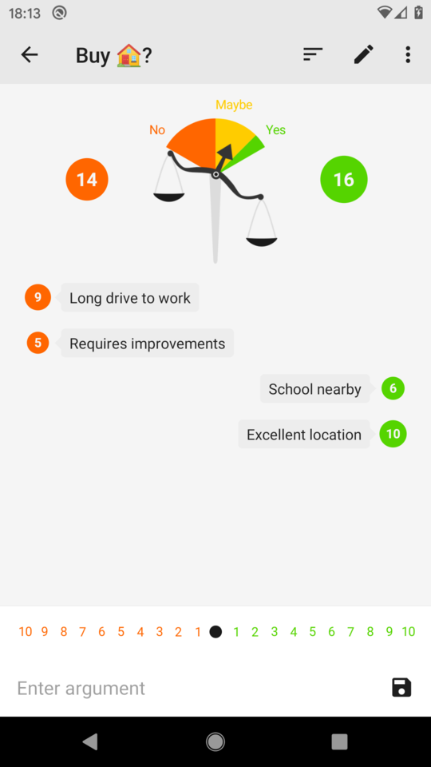
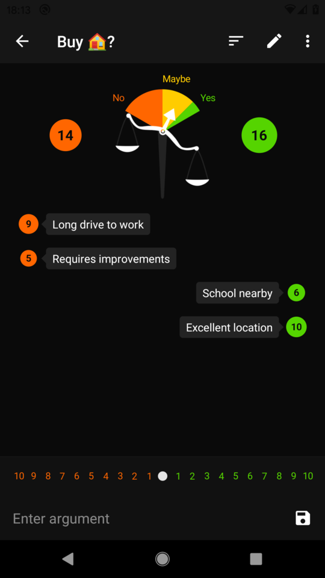

# Decisions

Android app that helps making decisions. Works like this:

1. Write down pros and cons
2. Weigh arguments from 1 to 10
3. Get a recommendation

Inspired by this [Time article][trick-for-decisions].

## Screenshots

## Download

[trick-for-decisions]: http://time.com/3772262/billionaire-trick-for-decisions/
